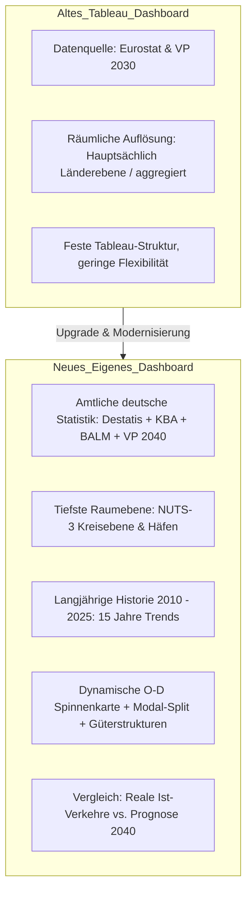

# Güterverkehrsströme Deutschland – Datenkatalog & Fachkonzept

Dieses Dokument fasst den gesamten Datenbestand, die methodischen Grundlagen aus den Datensatzbeschreibungen (PDFs) sowie das technische und fachliche Konzept für die Entwicklung eines interaktiven Dashboards für Güterverkehrsströme zusammen.

---

## 1. Datenbestand & Inventar

Die vorhandenen Rohdaten decken alle vier Hauptverkehrsträger des Güterverkehrs mit Deutschland-Bezug, hochauflösende Geometrien (NUTS / GISCO) sowie die offizielle Bundesverkehrsprognose (VP 2040) ab.

| Bereich | Datenquelle / EVAS | Zeitraum | Räumliche Ebene | Gütergliederung | Wesentliche Kennzahlen |
| :--- | :--- | :--- | :--- | :--- | :--- |
| **Binnenschifffahrt** | Destatis (EVAS 46321) | 2011 – 2025 | Hafen (HafenID, UN/LOCODE), NUTS-3, ISO | NST-2007 (3-Steller & 2-Steller) | Tonnen, Tonnenkilometer, TEU, TEU-km, Schiffstyp, Flagge |
| **Seeverkehr** | Destatis (EVAS 46331) | 2011 – 2025 | Deutscher Hafen (UN/LOCODE), Partnerhafen (NUTS-3 / ISO weltweit) | NST-2007 (3-Steller) | Gütergewicht (t), TEU, Containerstatus (leer/voll, 20ft/40ft), Schiffstyp |
| **Schienengüterverkehr** | Destatis (EVAS 46131) | 2016 – 2025 | Inland: NUTS-3, Ausland: NUTS-2 | NST-2007 (3-Steller & 2-Steller) | Beförderungsmenge (t), Beförderungsleistung (TKM), TEU, Ladeeinheiten |
| **Straßengüterverkehr (O-D)** | KBA / Eurostat (VE 7) | 2010 – 2024 | Beladung & Entladung auf NUTS-3 (In- & Ausland) | Aggregiert (Gesamtverkehr) | Fahrten, km, Inlands-km, Tonnen, Tkm, Inlands-Tkm |
| **Straßengüterverkehr (Güter)** | KBA (VE 12 / VE 13) | 2010 – 2024 | Versand / Empfang auf NUTS-3 | 7 Güterhauptgruppen | Fahrten, km, Tonnen, Tkm |
| **Straßengüterverkehr (Detail)** | KBA (VD 3c-V / VD 3c-E) | 2016 – 2024 | Versand / Empfang auf NUTS-2 | 20 NST-2007 Abteilungen | Inlands- & Gesamtfahrten, km, Tonnen, Tkm (dt. Lkw) |
| **Straßengüterverkehr (Distanz)** | KBA (VD 2-V / VD 2-E) | 2016 – 2024 | Versand / Empfang auf NUTS-3 | Entfernungsstufen (Nah-/Fernbereich) | Fahrten, km, Tonnen, Tkm (dt. Lkw) |
| **Mautdaten** | BALM / Toll Collect | Monatlich | Streckenabschnitte / Zählstellen | Gesamtverkehr | Maut-Fahrleistung, Lkw-Aufkommen |
| **Geometrien** | Eurostat GISCO | 2016, 2021, 2024 | NUTS 0, NUTS 1, NUTS 2, NUTS 3 | – | Grenzpolygone, Zentroide (EPSG:3035 / WGS84) |
| **Verkehrsprognose 2040** | BMV/BMDV / Intraplan / Trimode / ETR / MWP | Basis 2019, Horizont 2040 | NUTS-3 & Verkehrszellen (VZ) | NST-2007 / VP-spezifisch | O-D-Matrizen für das Basisjahr 2019 und 2040 P1 sind auf identischer NUTS-3-Grundlage integriert; die intermodalen Transportketten liegen zusätzlich vor |

---

## 2. Methodische Erkenntnisse aus den Fachdokumenten (PDFs)

### 2.1 Räumliche Nomenklatur und jahresspezifische Darstellung
* **NUTS-Revisionen über die Jahre**: Die amtliche Statistik wechselt in Intervallen von 3–4 Jahren die NUTS-Version:
  * 2016–2020: NUTS 2016
  * 2021–2023: NUTS 2021
  * ab 2024: NUTS 2024
* **Konsequenz im Dashboard**: Die Geometrie wird bewusst nach dem Gebietsstand des Berichtsjahres ausgewählt. Damit bleiben die amtlichen räumlichen Bezugseinheiten sichtbar. Zeitvergleiche über Gebietsstandsänderungen hinweg sind als Vergleiche der jeweiligen Jahresscheiben zu lesen, nicht als nachträglich harmonisierte NUTS-2024-Zeitreihe.
* **Auslandsebene**: Während das Inland bei Eisenbahn und Straße bis zur Kreisebene (NUTS-3) vorliegt, werden Auslandsregionen bei der Bahn auf NUTS-2, bei KBA VE7 teilweise auf NUTS-3 und im Seeverkehr auf Länderebene (ISO-2) erfasst.

### 2.2 Gütersystematik (NST-2007)
* Die europäische Güterklassifikation **NST-2007** bildet die gemeinsame Klammer aller amtlichen Statistiken.
* **Hierarchie**:
  1. *Ebene 1*: 7 Güterhauptgruppen (verwendet in KBA VE12/VE13 für Straßengüterverkehr auf NUTS-3).
  2. *Ebene 2*: 20 Güterabteilungen (01 bis 20; verwendet in KBA VD3c, Eisenbahn, Binnenschiff und Seeschiff).
  3. *Ebene 3*: 3-Steller Gütergruppen (verwendet bei Binnenschiff, Seeschiff und Eisenbahn).

### 2.3 Erfassungsbereiche & Repräsentativität
* **Straße (KBA)**:
  * `VE 7` enthält Verflechtungsdaten europäischer Lkw mit Bezug zum Bundesgebiet (über Eurostat-Austausch).
  * Die `VD`-Reihe (VD2, VD3c) bezieht sich primär auf in Deutschland gemeldete Lastkraftfahrzeuge (Stichprobenerhebung nach Güterkraftverkehrsstatistik-Gesetz).
  * **Statistische Geheimhaltung**: Tabellenfelder mit wenigen Stichprobenfällen werden im KBA mit ZS-Kennzeichnungen (z.B. `()`) versehen, um Betriebsgeheimnisse zu wahren.
  * **NUTS-3-Güterstruktur**: VE12/VE13 liefern die amtlich mit Destatis abgestimmten sieben zusammengefassten Güterpositionen. Eine Aufteilung auf 20 Abteilungen wird im Dashboard nicht modellhaft hinzugerechnet.
* **Eisenbahn (Destatis)**:
  * Erfasst alle Eisenbahnverkehrsunternehmen (EVU) mit Verkehrsleistungen auf dem deutschen Schienennetz (Beförderung ab 10 Mio. tkm oder 1 Mio. Tonnen pro Jahr).
* **Binnenschifffahrt & Seeverkehr (Destatis)**:
  * Vollerhebung aller Ein- und Ausladungen in Häfen mit wasserseitigem Umschlag ab Mindestumschlagsmengen.

### 2.4 Intermodale Verkehre und Kombinierter Verkehr
* **Zweck:** Nationale Einordnung der beiden im Ausgangsbestand nachvollziehbar abgrenzbaren Teilmärkte.
* **Schiene (EVAS 46131):** Ausgewiesen werden Güterbewegungen mit einer Ladeeinheit ungleich „Keine“. Die Struktur unterscheidet Container/Wechselbehälter, unbegleitete Sattelanhänger, begleitete Straßenfahrzeuge und weitere Ladeeinheiten.
* **Binnenschiff (EVAS 46321):** Ausgewiesen werden Güterbewegungen mit einer angegebenen Containergrößenklasse; die Größenstruktur unterscheidet 20 Fuß, 40 Fuß und weitere Größenklassen.
* **Abgrenzung:** Die Teilmärkte werden nicht zu einer KV-Gesamtsumme addiert. Eine Transportkette kann in beiden amtlichen Statistiken vorkommen.
* **Zeit und Filter:** Die Quelle deckt vollständig die Jahre 2016 bis 2025 ab. Bezugsjahr und Kennzahl (Tonnen bzw. Tonnenkilometer) werden zentral gesteuert; regionale, richtungs- und güterartenspezifische Filter sind für diese nationale Auswertung nicht verfügbar und werden ausdrücklich als nicht anwendbar ausgewiesen.

---

## 3. Vergleich & Weiterentwicklung: Altes Tableau vs. Neues Dashboard

### Kern-Mehrwerte der neuen Anwendung:
1. **Kreisscharfe Detailanalysen (NUTS-3)**: Woher kommen die Güterströme für einen konkreten Landkreis (z.B. Landkreis Emsland, Rhein-Neckar-Kreis, Region Stuttgart)?
2. **Verkehrsträger-Vergleich (Modal Split)**: Welche Regionen verlagern Güter von der Straße auf Schiene oder Wasserstraße?
3. **Güterstruktureller Wandel**: Welche Güterarten (z.B. Kohle, Mineralölerzeugnisse, Baustoffe, chemische Erzeugnisse) gewinnen oder verlieren in welchen Regionen an Bedeutung?
4. **Prognoseüberlagerung (VP 2040 vs. Ist)**: Vergleich der tatsächlichen Entwicklung (2010–2025) mit dem Modellkorridor der VP 2040.

---

## 4. Zielarchitektur & Datenverarbeitung

```mermaid
flowchart LR
    subgraph Raw_Layer [1. Rohdaten]
        R1[IWW CSVs 2011-2025]
        R2[MRTM CSVs 2011-2025]
        R3[SGV CSVs 2016-2025]
        R4[KBA CSVs 2010-2024]
        R5[NUTS Geopackages]
        R6[VP2040 VZ/NUTS3]
    end

    subgraph Processing_Layer [2. Vorverarbeitung & ETL]
        P1[Encoding & Clean-Up]
        P2[Jahresspezifische NUTS-Geometrie]
        P3[NST-2007 Taxonomie Mapping]
        P4[Parquet / DuckDB Aggregationen]
    end

    subgraph Application_Layer [3. Interaktives Web-Tool]
        U1[O-D Flow Map / Deck.gl / MapLibre]
        U2[Modal-Split & Zeitreihen-Explorer]
        U3[Regionale Steckbriefe & NST-2007 Drilldown]
        U4[Szenario- & Prognosevergleich VP2040]
    end

    Raw_Layer --> Processing_Layer
    Processing_Layer --> Application_Layer
```

---

## 5. Maschinenlesbarer Katalog

Der vollständige Metadatenkatalog wurde als maschinenlesbare Datei unter `data_catalog.json` im Hauptverzeichnis hinterlegt.
