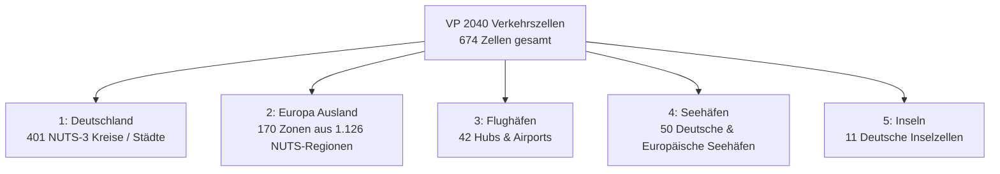

# Umstiegsschlüssel & Harmonisierungsdokumentation: Verkehrsprognose 2040 (VP 2040)

Dieses Verzeichnis (`data/crosswalks/`) enthält alle verbindlichen Umstiegsschlüssel (Mapping-Tabellen) und Referenzdateien zur nahtlosen Zusammenführung der **Verkehrsprognose 2040 (VP 2040 - Basisprognose P1)** mit den amtlichen Ist-Statistiken (**Destatis EVAS, KBA, BALM, Eurostat GISCO**) in unserem Analyse- und Dashboard-System.

---

## 1. Übersicht der Dateien in diesem Verzeichnis

| Dateiname | Format | Inhalt / Zweck |
| :--- | :--- | :--- |
| [`crosswalk_nst_vp2040.csv`](file:///D:/HiDrive/01_Projekte/WBP-Solutions/Tools/Güterströme/data/crosswalks/crosswalk_nst_vp2040.csv) | CSV (UTF-8, `;`) | Vollständiger Umstiegsschlüssel der **25 VP2040-Gütergruppen** auf die **20 NST-2007-Abteilungen** und die **7 NST-2007-Güterhauptgruppen**. |
| [`crosswalk_nst_vp2040.json`](file:///D:/HiDrive/01_Projekte/WBP-Solutions/Tools/Güterströme/data/crosswalks/crosswalk_nst_vp2040.json) | JSON (UTF-8) | Maschinenlesbare Hierarchie für Web-Dashboard, ETL-Skripte und Frontend-Filter. |
| [`crosswalk_spatial_vp2040.csv`](file:///D:/HiDrive/01_Projekte/WBP-Solutions/Tools/Güterströme/data/crosswalks/crosswalk_spatial_vp2040.csv) | CSV (UTF-8, `;`) | Vollständiger Umstiegsschlüssel aller **674 VP2040-Verkehrszellen** auf **NUTS 2016**, **NUTS 2024**, **AGS (5-stellig)**, **UN/LOCODE** (Seehäfen) und **ISO-2-Ländercodes**. |
| [`crosswalk_spatial_vp2040.json`](file:///D:/HiDrive/01_Projekte/WBP-Solutions/Tools/Güterströme/data/crosswalks/crosswalk_spatial_vp2040.json) | JSON (UTF-8) | Strukturierte JSON-Repräsentation aller 674 Verkehrszellen für Frontend-Geocoding und Spinnenkarten. |

---

## 2. Gütersystematik: VP2040 (25 Gruppen) und die sieben NST-2007-C-Gruppen

Die 25 Positionen der VP 2040 werden im Dashboard nicht fachlogisch neu geordnet, sondern auf die **amtliche zusammenfassende NST-2007-Gliederung C1–C7** abgebildet. Maßgeblich sind das KBA-Referenzhandbuch VE13 und die NST-2007-Klassifikation. Das Kriterium ist die zugehörige NST-Abteilung; die Bezeichnung der VP-Position dient als zweite, unabhängige Prüfebene.

| C-Gruppe | NST-2007-Abteilungen | Bezeichnung |
| :---: | :--- | :--- |
| C1 | 01–03 | Erzeugnisse der Land- und Forstwirtschaft, Rohstoffe |
| C2 | 04–06 | Konsumgüter zum kurzfristigen Verbrauch, Holzwaren |
| C3 | 07–09 | Mineralische, chemische und Mineralölerzeugnisse |
| C4 | 10 | Metalle und Metallerzeugnisse |
| C5 | 11–13 | Maschinen und Ausrüstungen, langlebige Konsumgüter |
| C6 | 14 | Sekundärrohstoffe, Abfälle |
| C7 | 15–20 | Sonstige Produkte |

Das hat insbesondere folgende Konsequenzen: Steinkohle, Braunkohle, Erdöl/Erdgas sowie Erze und Steine/Erden gehören sämtlich zu C1. Düngemittel gehören als VP-Sonderposition zur Abteilung 08 und damit zu C3. Die VP-Codes 120 bis 200 folgen den Abteilungen 12 bis 20; insbesondere sind 120 Fahrzeuge = 12, 130 Möbel = 13, 140 Abfälle = 14, 150 Post = 15, 160 Ladehilfsmittel = 16 und 180 Sammelgut = 18.

Die vollständige prüfbare Zuordnung steht maschinenlesbar in `crosswalk_nst_vp2040.csv` und `crosswalk_nst_vp2040.json`. Bei Datenaktualisierungen müssen Code, VP-Begriff, NST-Abteilung und C-Gruppe gemeinsam geprüft werden.

### 2.1 Verbindlicher Prüfvertrag des VP2040-Güterschlüssels

Die CSV-Datei ist die lesbare Prüftabelle, die JSON-Datei die Laufzeitfassung. Keine von beiden darf unabhängig geändert werden. Beide müssen genau dieselben 25 eindeutigen VP-Codes und dieselben fachlichen Felder enthalten: VP-Code, VP-Begriff, NST-Abteilung mit Bezeichnung sowie C-Gruppe mit Bezeichnung. Die Felder `split_notes` sind lediglich erläuternd.

Die fachlichen Referenzen sind die zwei gelieferten VP-Listen `data/raw/VP2040/VP2040_2019_GV_NUTS3/nst2007.csv` und `data/raw/VP2040/VP2040_2040P1BP_GV_NUTS3/nst2007.csv`, die NST-2007-Klassifikation `data/raw/Straße/KBA/Empfang_VD3cE_NUTS2_20Gueter/nsz-2007.pdf` sowie das VE13-Referenzhandbuch. Die Codebreite ist kein fachliches Merkmal: 10, 21, 100 und 200 sind VP-Codes unterschiedlicher Länge. Entscheidend sind die gelieferten Begriffe und die daraus belegte NST-Abteilung.

`scripts/validate_vp2040_bundle.py` ist der verbindliche Abnahmetest. Er bricht bei einer unvollständigen oder doppelten Codeliste, einer fachlichen Differenz zwischen CSV und JSON, einer von der NST-Abteilung abweichenden C-Gruppe, abweichenden C-Gruppenbezeichnungen oder einem nicht belegbaren VP-Begriff ab. Erst danach werden die VP-Rohmatrizen gegen das erzeugte Dashboard-Paket nachgerechnet.

Ein Vergleich der VP-Basis 2019 mit amtlichen Istwerten ist ausdrücklich **kein** Gleichheitstest. Er dient der Abgrenzungsprüfung: Nur bei identischer Region, Richtung, Kennzahl, Verkehrsträger, C-Gruppe, Einheit und Grundgesamtheit dürfen die Reihen fachlich gegenübergestellt werden. Verbleibende Unterschiede werden als Quellen-/Abgrenzungsdifferenz dokumentiert, nicht durch eine Änderung des Crosswalks geglättet.

---

## 3. Räumliche Systematik: 674 Verkehrszellen der VP 2040

Die VP 2040 gliedert das Untersuchungsgebiet in **674 Verkehrszellen**:



### 3.1 Nummerierungs- & Kodierungslogik:
1. **Deutschland (`cell_type = 1`, Nummern < 2.000.000)**:
   - Die ersten 5 Ziffern entsprechen exakt dem 5-stelligen **Amtlichen Gemeindeschlüssel (AGS)** bzw. Kreisschlüssel des Statistischen Bundesamtes (z. B. `0100100` $\rightarrow$ `100100` = Flensburg, `0511100` $\rightarrow$ `511100` = Düsseldorf, `1100000` = Berlin).
   - Die letzten 2 Ziffern sind immer `00`.
   - **NUTS-Harmonisierung 2016 $\rightarrow$ 2024**:
     - *Eisenach (`1605600`, DEG0N)* wurde zum 01.07.2021 in den *Wartburgkreis (`1606300`, DEG0P)* eingegliedert. In unserem NUTS-2024-Zielbestand wird Eisenach auf `DEG0P` aggregiert.
     - *Göttingen (`315900`, DE91C)* ist in VP2040 bereits auf dem fusionierten Stand NUTS 2016 / 2024 (`DE91C`).
2. **Europa Ausland (`cell_type = 2`, Nummern > 2.000.000)**:
   - Stelle 1–3: Länderkennung nach BVWP-Systematik (z. B. `210` Dänemark, `410` Frankreich, `510` Niederlande, `500` Belgien, `520` Österreich, `530` Schweiz, `741` Litauen).
   - Stelle 4–5: `00`.
   - Stelle 6–7: `01` für Gesamtstaat bzw. laufende Zonennummer $\ge 11$ (z. B. `2100011` Kopenhagen).
3. **Flughäfen (`cell_type = 3`, Endung `900` in DE bzw. `000` im Ausland)**:
   - z. B. `210900` Flughafen Hamburg (HAM), `350900` Hannover (HAJ), `410900` Bremen (BRE), `640900` Frankfurt am Main (FRA), `910900` München (MUC).
4. **Seehäfen (`cell_type = 4`, 3. Stelle = 6, Endung `66`)**:
   - Alle Seehäfen enden auf `66` (z. B. `160166` Glückstadt, `160266` Brunsbüttel, `260166` Hamburg / DEHAM, `360166` Bremen / DEBRE, `360266` Bremerhaven / DEBRV, `360766` Wilhelmshaven / DEWVN, `1360166` Rostock / DERSK, `5160166` Rotterdam / NLRTM, `5060166` Antwerpen / BEANR).
5. **Inseln (`cell_type = 5`, 3. Stelle = 7, Endung `77`)**:
   - z. B. `370177` Borkum, `370277` Juist, `370377` Norderney.
6. **Übersee-Weltregionen (1 bis 16)**:
   - Im seeseitigen Außenhandel treten seewärtige Quell- und Zielzellen mit IDs `1` bis `16` auf (z. B. Nordamerika Ost-/Westküste, Ostasien/China, Nahost, Südamerika etc.).

---

## 4. Variablen und Merkmale der Nachfragematrizen

Die Matrizen in `data/raw/VP2040/VP2040_2040P1BP_GV_NUTS3/` weisen eine einheitliche 13-spaltige Struktur auf:

| Spalte | Typ | Wertebereich | Beschreibung |
| :--- | :--- | :--- | :--- |
| `Quellzelle` | Integer | 1 .. 7.990.001 | Ausgangspunkt des Gütertransports (Verkehrszelle VP 2040) |
| `Zielzelle` | Integer | 1 .. 7.990.001 | Endpunkt des Gütertransports (Verkehrszelle VP 2040) |
| `HVBZ` | Integer | 1 .. 4 | **Hauptverkehrsbeziehung**: 1 = Binnenverkehr (DE $\rightarrow$ DE), 2 = Export (DE $\rightarrow$ Ausland), 3 = Import (Ausland $\rightarrow$ DE), 4 = Transit (Ausland $\rightarrow$ Ausland via DE) |
| `Guetergruppe` | Integer | 10 .. 200 | **Gütergruppe** nach VP2040-Klassifikation (25 Gruppen) |
| `Mode` | Integer | 1 .. 5 | **Verkehrsmittel**: 1 = Schiene, 2 = Straße, 3 = Binnenschiff, 4 = Seeschiff, 5 = Luft |
| `Hinterland` | Integer | 0 .. 4 | **Hinterland-Merkmal**: 0 = n.b., 1 = kein Hinterland, 2 = Seehafen-Hinterland (nicht-Container), 3 = Seehafen-Hinterland (Container), 4 = Flughafen-Hinterland |
| `VerkArt` | Integer | 0 .. 2 | **Verkehrsart**: 0 = n.b., 1 = Konventioneller Verkehr, 2 = Kombinierter Verkehr (KV / Container / RoLa) |
| `BehTyp` | Integer | 0 .. 10 | **Behältertyp**: 0 = n.b., 1 = Container $\le$ 20ft beladen, 2 = 25-30ft beladen, 3 = &gt;30ft beladen, 4 = Sattelauflieger beladen, 5–8 = leer, 10 = Container 20ft |
| `Tonnen` | Float | $\ge 0$ | Transportaufkommen in Tonnen pro Jahr |
| `Tkm` | Float | $\ge 0$ | Inländische Verkehrsleistung in Tonnenkilometern pro Jahr (Territorialleistung im deutschen Netz) |
| `Ladeeinheiten` | Integer | $\ge 0$ | Beförderte intermodale Ladeeinheiten (Container, Wechselbehälter, Trailer) |
| `TEU` | Integer | $\ge 0$ | Beförderte Container in TEU (Twenty-Foot Equivalent Units) |
| `Transportwert` | Float | $\ge 0$ | Transportwert der Ladung in Euro (€) (ausgenommen reiner Seeverkehr) |

---

## 5. Kennzahlenübersicht: Basisprognose 2040 (Fall P1)

| Verkehrsträger | Datei in `VP2040_2040P1BP_GV_NUTS3` | Datensätze | Aufkommen (Mio. t) | Leistung (Mrd. tkm) | KV-Anteil (t) | Transportwert (Mrd. €) |
| :--- | :--- | :---: | :---: | :---: | :---: | :---: |
| **Straßengüterverkehr** | `...GV_Strasse_NUTS3_Matrix_V01.csv` | 2.832.606 | **4.475,83** | **668,41** | 3,46 % | 10.387,72 Mrd. € |
| **Schienengüterverkehr** | `...GV_Bahn_NUTS3_Matrix_V01.csv` | 35.624 | **461,00** | **187,96** | 45,88 % | 2.667,96 Mrd. € |
| **Binnenschifffahrt** | `...GV_Bischi_NUTS3_Matrix_V01.csv` | 11.909 | **173,92** | **48,16** | 20,73 % | 424,30 Mrd. € |
| **Seeschifffahrt** | `...GV_Seehaf_NUTS3_Matrix_V01.csv` | 17.118 | **482,71** | **27,42** | 70,43 % | *(nicht bewertet)* |
| **Gesamt** | *(Straße + Bahn + Bischi + Seehafen)* | **2.897.257** | **5.593,46** | **931,95** | **13,29 %** | **13.479,98 Mrd. €** |

---

## 6. Integrations-Codebeispiel (Python)

```python
import pandas as pd
import json

# 1. Crosswalks laden
df_nst_crosswalk = pd.read_csv("data/crosswalks/crosswalk_nst_vp2040.csv", sep=";")
df_spatial_crosswalk = pd.read_csv("data/crosswalks/crosswalk_spatial_vp2040.csv", sep=";")

# 2. Matrix laden (z.B. Bahn)
df_bahn = pd.read_csv("data/raw/VP2040/VP2040_2040P1BP_GV_NUTS3/VP2040_2040P1BP_GV_Bahn_NUTS3_Matrix_V01.csv", sep=";", encoding="latin1")

# 3. NST-Hauptgruppe und 20-Abteilungen anspielen
df_bahn = df_bahn.merge(
    df_nst_crosswalk[["vp40_code", "nst2007_division", "nst2007_group7", "nst2007_group7_name"]],
    left_on="Guetergruppe",
    right_on="vp40_code",
    how="left"
)

# 4. Quell- und Zielregionen auf harmonisierten NUTS-2024-Stand überführen
spatial_map = df_spatial_crosswalk.set_index("cell_id")["nuts3_2024"].to_dict()
df_bahn["source_nuts3"] = df_bahn["Quellzelle"].map(spatial_map).fillna("FOREIGN")
df_bahn["dest_nuts3"] = df_bahn["Zielzelle"].map(spatial_map).fillna("FOREIGN")
```
