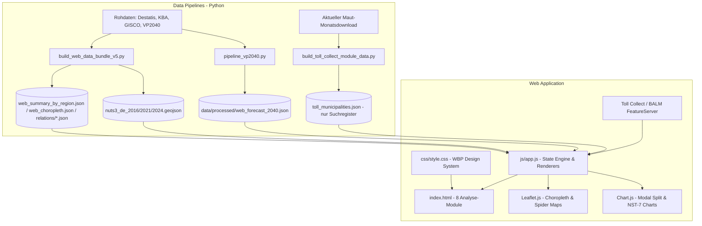

# Technisches Handbuch & Systemdokumentation: Güterströme Deutschland

## 1. Projektübersicht & Fachkonzept

Das **WBP Güterströme-Dashboard** ist eine interaktive, webbasierte Business-Intelligence- und Geodaten-Anwendung zur Visualisierung und multimodalen Analyse der Güterverkehrsströme in Deutschland.

### Fachlicher Erfassungsbereich
* **Räumliche Ebene**: Deutsche Landkreise und kreisfreie Städte auf NUTS-3-Ebene sowie aggregierte Bundes- und Auslandsverflechtungen. Die VP2040 verwendet für ihr Basisjahr 2019 einen NUTS-2016-bezogenen Verkehrs-zellenstand mit 401 deutschen Flächenzellen und zusätzlichen Hafen-, Flughafen- und Inselzellen.
* **Verkehrsträger**: 
  1. Straßengüterverkehr (KBA / Eurostat)
  2. Schienengüterverkehr (Destatis EVAS 46131)
  3. Binnenschifffahrt (Destatis EVAS 46321)
  4. Seeverkehr (Destatis EVAS 46331)
  5. Kombinierter / Intermodaler Verkehr (SGKV / Destatis)
  6. Bundesverkehrsprognose 2040 (BMDV / Intraplan / Trimode)
* **Zeithorizonte**:
  * **Ist-Daten (fachlicher Bestand)**: 2010 – 2025 (16 Kalenderjahre); die vergleichbare, im Dashboard auswählbare multimodale Ansicht reicht derzeit von 2016 bis 2024.
  * **Prognose-Daten**: Basisjahr 2019 vs. Prognosehorizont 2040 (Basisfall P1)
* **Güterklassifikation**: Amtliche Systematik **NST-2007** (7 Hauptgruppen und 20 Abteilungen).

---

### 1.1 Aktuelle Analyse-Module

| Modul | Zweck und zentrale Funktionen | Datenquellen / räumliche Ebene |
|---|---|---|
| **Übersicht** | Vergleich der drei landseitigen Verkehrsträger, Karte regionaler Kennwerte, Top-Relationen, Modal Split und Güterstruktur für eine ausgewählte Region. | KBA, Destatis; überwiegend NUTS-3, im Ausland abhängig von der Quelle. |
| **Straßengüterverkehr** | Regionale Straßenverkehrskennwerte, Versand-/Empfangsbeziehungen und Güterstruktur nach sieben NST-2007-Hauptgruppen. | KBA VE 7, VE 12/VE 13, VD 2 und VD 3c; NUTS-3 bzw. NUTS-2 nach Tabelle. |
| **Schienengüterverkehr** | Regionale Kennwerte, Quell- und Zielrelationen sowie Güterstruktur des Eisenbahnverkehrs. | Destatis EVAS 46131; Inland NUTS-3, Ausland NUTS-2. |
| **Binnenschifffahrt** | Hafen- und regionale Kennwerte, Relationen und Güterstruktur. | Destatis EVAS 46321; Hafen- und NUTS-Ebenen. |
| **Seeverkehr & Häfen** | Profile deutscher Seehäfen mit Empfang, Versand, Güterstruktur und internationalen Partnerbeziehungen. | Destatis EVAS 46331; deutsche Häfen und internationale Partner. |
| **Intermodaler Verkehr & KV** | Getrennte Betrachtung der abgrenzbaren KV-Teilbereiche auf Schiene und Binnenschiff, einschließlich Ladeeinheiten bzw. Containergrößen und inländischer Relationen. | Destatis EVAS 46131 und 46321. Die Teilmärkte werden nicht zu einer Gesamtsumme addiert. |
| **Verkehrsprognose 2040** | Karten- und Relationsanalyse der Bundesverkehrsprognose für den Prognosefall 2040 (P1). | Bundesverkehrsprognose 2040; Verkehrszellen und NUTS-3-Bezüge. |

Die Quellen, Zeitbezüge, räumlichen Ebenen und Kennzahlen sind im maschinenlesbaren Katalog `data_catalog.json` detailliert dokumentiert. Die Module verwenden nur Daten, deren räumliche und fachliche Abgrenzung zur jeweils dargestellten Kennzahl passt; ein unmittelbarer Vergleich verschieden abgegrenzter Quellen ist entsprechend kenntlich zu machen.

### 1.2 Eigenständiges Erweiterungsmodul: Mautdaten-Relationen

**Status:** als eigenständiges Live-Modul lokal integriert; der am 2. September 2026 vom offiziellen Portal verwendete API-Endpunkt wurde mit CORS, Monatsliste und Beispielabfrage geprüft. Die produktive Freigabe steht noch aus.

Das Modul ermöglicht eine ergänzende, gemeindebezogene Monatsanalyse auf Basis des Lkw-Maut-Portals von Toll Collect / BALM. Es ist bewusst von den bestehenden, jahresbezogenen NUTS-3-Analysen getrennt: Die Daten beschreiben Mautfahrten auf dem mautpflichtigen Netz, nicht den vollständigen Straßengüterverkehr und auch keine Gütermengen.

**Umgesetzte Nutzung:**

1. Start ohne voreingestellte Gemeinde: Die Karte zeigt zunächst die Bundeslandgrenzen. Ab Zoomstufe 7 lädt sie aus dem lokalen, geprüften BKG-VG250-Bestand nur die Bundesland-Dateien, die den sichtbaren Kartenausschnitt schneiden. So werden alle 10.949 amtlichen Gemeindegrenzen ohne Live-WFS-Lücken dargestellt; die 5.379 Gemeinden des aktuellen Toll-Collect-Registers sind anklickbar. Alternativ steht die Gemeindesuche unter „Aktuelle Einstellungen“ bereit. Die Berichtsmonate werden beim Laden als distinct Werte direkt aus der Mautdaten-API gelesen, damit nur aktuell unterstützte Monate auswählbar sind.
2. Wahl der Perspektive: Versand (`ags_start`, `richtung = 0`), Empfang (`ags_ziel`, `richtung = 1`) oder Versand + Empfang. In der kombinierten Ansicht werden beide gezielten Abfragen zusammengeführt; Summen werden addiert, Distanz und Fahrzeit nach Mautfahrten gewichtet und die identische Binnenrelation nur einmal berücksichtigt.
3. Anzeige der Gegenkommunen als Top-5-, Top-10- oder Top-20-Rangtabelle und als Relationendarstellung auf der Karte; Binnenrelationen können ein- oder ausgeblendet werden.
4. Ausweisung von Mautfahrten (API-Feld `anzahl_befahrungen`), Fahrleistung sowie mittleren Distanz- und Fahrzeitkennwerten in Tabelle und Karten-Hover.
5. Darstellung der Anteile der Mautfahrten nach Klassen der mittleren Relationsdistanz im unteren Diagramm.

**Bekannte Daten- und API-Grenzen:**

* Die API verlangt zwingend eine Gemeinde als Start oder Ziel zusammen mit der Richtung. Eine bundesweite Komplettabfrage aller Gemeinde-zu-Gemeinde-Relationen ist nicht zulässig.
* Die API-Abfrage der distinct Monatswerte lieferte am 2. September 2026 insgesamt 14 Monate von Juni 2025 bis Juli 2026. Diese Spanne wird nicht fest im Frontend hinterlegt, sondern bei jedem neuen Seitenaufruf aus der API aufgebaut; spätere Ergänzungen oder Entnahmen werden dadurch automatisch berücksichtigt.
* Der Downloadbereich des Portals stellt nach bisherigem Kenntnisstand nur den aktuellsten Monatsbestand als CSV bereit. Historische bundesweite Monatsbestände wären daher nicht automatisch als vollständiges Archiv verfügbar.
* `anzahl_befahrungen` kann für einen definierten Zeitraum summiert werden. Distanz- und Zeitkennwerte sind Verteilungs- bzw. Lagekennwerte und dürfen nicht über Monate addiert werden; bei einer Zeitraumauswertung wären sie getrennt monatlich oder als fachlich begründete gewichtete Kennwerte auszuweisen.
* Vor einer Produktivfreigabe sind Ergebnislimits, Seitennavigation, zulässige Abruffrequenz, CORS bzw. eine sichere Serveranbindung und die Lizenzangabe produktiv zu prüfen. Eine lokale Abschaltung der Zertifikatsprüfung ist ausschließlich ein Diagnoseschritt und keine zulässige Produktionslösung.

---

## 2. Systemarchitektur & Technologie-Stack

Die Anwendung ist als performante **Client-Side Single-Page Application (SPA)** konzipiert. Die bestehenden Analysebereiche verwenden weiterhin optimierte lokale JSON-Datenbündel. Nur das Mautdaten-Modul ruft Relationswerte gezielt und ohne Zugangsdaten live aus der externen API ab; seine lokale JSON-Datei enthält ausschließlich das Gemeinderegister für die Suche. Die Gemeinde- und Staatsgrenzen liegen als geprüfter lokaler BKG-VG250-Bestand vor; ab Zoomstufe 7 lädt das Frontend nur die den Kartenausschnitt schneidenden Bundesland-Dateien.



### Frontend-Kerntechnologien:
* **HTML5**: Semantische Struktur mit responsivem Container-Layout.
* **Vanilla CSS3**: Modernes WBP-Designsystem mit zentralen Fachfarben, CSS Grid & Flexbox sowie Mobil-Breakpoints.
* **Vanilla JavaScript (ES6+)**: Zentrales reaktives `state`-Objekt, Geometrieverarbeitung und DOM-Aktualisierung.
* **Leaflet.js (v1.9.4)**: Karten-Rendering (Choroplethen, interaktive Tooltips, gerade O-D-Verbindungslinien, Legenden).
* **Chart.js (v4.4.1)**: Donut-Diagramme (Modal Split), horizontale/vertikale Balkendiagramme (Güterstrukturen, KV-Ladeeinheiten, Zeitreihen).

---

## 3. Dateistruktur & Speicherorte

```
Güterströme/
├── README.md                         # Einstieg für Menschen
├── AGENTS.md                         # Arbeitsreihenfolge für KI-Assistenten
├── data_catalog.json                 # Maschinenlesbarer Datenkatalog
├── schema_mysql_postgres.sql         # Optionales relationales Zielschema
├── docs/
│   ├── README.md                     # Zentrales Dokumentationsverzeichnis
│   ├── betrieb/                      # Betrieb, Aktualisierung und Systemhandbuch
│   ├── fachkonzept/                  # Datenmodell und fachliche Begriffe
│   ├── qualitaet/                    # Prüfplan und dokumentierte Design-QA
│   └── roadmap/                      # Geplante, noch nicht zwingend umgesetzte Schritte
├── scripts/
│   ├── README.md                     # Skriptstatus und zentrale Aufrufe
│   ├── pipelines/                    # Aktive Datenaufbereitung
│   ├── frontend/                     # Aufbau der Browserdateien
│   ├── validation/                   # Automatisierte Prüfungen
│   ├── geodata/                      # Räumliche Grundlagen
│   ├── toll/                         # Mautdatenmodul
│   ├── utilities/                    # Gezielte Hilfsschritte
│   ├── examples/                     # Abfragebeispiele
│   └── legacy/                       # Historische, nicht aktive Bundler
├── data/
│   ├── raw/                          # Ausgangsdaten
│   ├── crosswalks/                   # Räumliche und fachliche Umstiegsschlüssel
│   └── processed/                    # Aufbereitete Dashboard-Daten
├── html/                             # Modulare HTML-Quellen
├── css/source/                       # Modulare CSS-Quellen
├── js/source/ und js/modules/        # Modulare JavaScript-Quellen
├── index.html                        # Generierte Hauptanwendung
├── css/style.css                     # Generiertes Stylesheet
└── js/app.js                         # Generierte Anwendungslogik
```

Die vollständige Zuordnung der Dokumente steht in `docs/README.md`; aktive Skripte und ihre Aufrufe sind in `scripts/README.md` beschrieben.

---

## 4. Daten-Pipelines & ETL-Prozesse

Die vollständige, releasefähige Zuordnung von Rohdaten, Berechnungsschritten,
Ausgabedateien und Prüfschritten steht in
[`ANLEITUNG_DATENAKTUALISIERUNG.md`](ANLEITUNG_DATENAKTUALISIERUNG.md). Dieses
Kapitel gibt die fachlich-technische Übersicht; die Anleitung ist für die
Durchführung eines neuen Datenupdates maßgeblich.

### 4.1 ETL für Ist-Daten (`scripts/pipelines/build_web_data_bundle_v5.py`)
1. **Jahresscheiben mit amtlichem Gebietsstand**: Die Anwendung nutzt je Berichtsjahr die passende NUTS-Geometrie (2016, 2021 oder 2024). Sie erzeugt ausdrücklich keine künstlich harmonisierte Zeitreihe auf NUTS 2024.
2. **Taxonomie-Mapping**: Normalisierung auf die amtlichen sieben zusammengefassten NST-2007-Güterpositionen. Die 20 Abteilungen werden nur dort ausgegeben, wo der Quellbestand sie räumlich passend liefert; KBA VE12/VE13 ist auf NUTS-3 auf sieben Gruppen begrenzt.
3. **Bilaterale Verflechtungs-Matrizen**: Aggregation der Top-O-D-Beziehungen je Landkreis mit Ausweisung von Transportmenge (Tonnen), Verkehrsleistung (tkm), Verkehrsträgern und Modal Split.
4. **Export**: Generiert die getrennten Webartefakte `web_summary_by_region.json`, `web_choropleth.json`, `web_maritime.json`, `web_regions.json` sowie nach Regionen partitionierte O-D-Dateien unter `relations/`.

### 4.2 ETL für intermodale Verkehre und KV (`scripts/pipelines/build_intermodal_data.py`)
1. **Quellen und Zeitraum:** Liest die jährlichen Destatis-Dateien EVAS 46131 (Schiene) und EVAS 46321 (Binnenschifffahrt) für 2016 bis 2025 ein und prüft die Monatsabdeckung.
2. **Fachliche Abgrenzung:** Schiene umfasst die ausgewiesenen Ladeeinheiten, Binnenschiff den Verkehr mit einer ausgewiesenen Containergrößenklasse. Die Ergebnisse werden nicht addiert.
3. **Relationen:** Ermittelt für beide Teilmärkte zusätzlich die inländischen NUTS-3-Relationen. Schiene wird über eine ausgewiesene Ladeeinheit ungleich „Keine“, Binnenschiff über eine ausgewiesene Containergrößenklasse abgegrenzt.
4. **Export:** Erzeugt `web_intermodal.json` mit Jahreswerten für Tonnen und Tonnenkilometer, Strukturen der Ladeeinheiten und Containergrößen sowie den getrennten Relationen für Karte und Rangtabelle. Der zentrale Top-Filter greift je Teilmarkt, damit beide Teilmärkte sichtbar bleiben.

### 4.3 Hafenprofile im Seeverkehr (`scripts/pipelines/build_maritime_port_profiles.py`)
1. **Quelle und Zeitraum:** Liest die bereits im Projekt abgelegten jährlichen Destatis-Dateien EVAS 46331 für 2016 bis 2025.
2. **Abgrenzung:** Ergänzt die kartierten deutschen Seehäfen um Empfang, Versand, NST-2007-Güterstruktur und internationale Partnerländer. Die Partnerbeziehungen werden nur nach Auswahl eines Hafens gezeigt.
3. **Ausführung:** Nach einem vollständigen Neuaufbau von `web_maritime.json` dieses Skript ebenfalls ausführen, damit die hafenbezogenen Profile erhalten bleiben.

### 4.4 ETL für Verkehrsprognose 2040 (`scripts/pipelines/pipeline_vp2040.py`)
1. **Multidimensionaler Aggregationswürfel**:
   * Vorberechnung sämtlicher Filterdimensionen je NUTS-3 Landkreis:
     * **Metrik**: Beförderungsmenge (`tonnes`) & Verkehrsleistung (`tkm`)
     * **Richtung**: `all` (Gesamt), `outbound` (Versand), `inbound` (Empfang), `balance` (Netto-Saldo), `binnen` (Binnenverkehr)
     * **Güterart**: Gesamt (`ALL`) sowie NST-2007 Gruppen `1` bis `7`
     * **Verkehrsträger**: Straße (`road`), Schiene (`rail`), Binnenschiff (`iww`)
     * **KV-Ladeeinheiten**: Behältertypen 1 bis 8 (20ft, 40ft, Wechselbehälter, Sattelauflieger, RoLa, Leerbehälter)
2. **Basisjahr-Vergleich und Modalstruktur**: Die originalen NUTS-3-Matrizen für das Basisjahr 2019 und die Basisprognose 2040 (P1) werden mit demselben Verfahren aggregiert. Nationale, regionale und relationsspezifische Veränderungen werden ausschließlich aus diesen beiden Matrizensätzen berechnet; bei einem Nullwert im Basisjahr wird kein Prozentwert ausgewiesen. Da jede Rohmatrix Gütergruppe und Verkehrsträger gleichzeitig führt, werden die drei Landverkehrsträger auch für jede der sieben NST-2007-Hauptgruppen getrennt ausgegeben.
3. **Export**: Generiert `web_forecast_2040.json` mit den auswählbaren Szenarien `2019_BASE` und `2040_P1`.

---

## 5. Visualisierungs- & Interaktionskonzept

### 5.1 Farbkonzept & Barrierefreiheit
* **Verkehrsträger-Kennfarben**:
  * Straße (Lkw): Amber / Orange (`#f59e0b`)
  * Schiene (Bahn): Royal Blue (`#2563eb`)
  * Binnenschiff: Teal (`#0f766e`)
  * Seeverkehr: Deep Indigo (`#4f46e5`)
  * Gesamt/Übersicht: Emerald Green (`#059669`)
* **Verkehrsprognose 2040**:
  * **Verbindungslinien (Spinnennetz)**: Distinktes Royal Violett (`#7c3aed`) mit weißen Endpunkten (`#ffffff`), um jede Verwechslung mit Straßenfarben auszuschließen.
  * **Choroplethen-Hintergrund**: Elegante, dezente Sky-Slate-Palette (`#f8fafc` bis `#2563eb`).
  * **Verkehrssaldo (Divergierend)**: Sanfte Pastelltöne (Grün `#f0fdf4`–`#22c55e` für Versandüberschuss; Blau `#f0f9ff`–`#38bdf8` für Empfangsüberschuss).
* **KPI-Karten**: Jede Modulübersicht besitzt einen farbigen oberen Akzent. In den fachlich gemischten Prognose-KPIs entspricht er jeweils dem Verkehrsträger; sonst folgt er der Modulfarbe.

### 5.2 Interaktivität & Reaktivität
1. **Zentraler State Manager**: Jede Filteränderung (Region, Jahr, Szenario, Metrik, Richtung, Güterart, Top-X, Binnenverkehr) triggert eine synchrone Aktualisierung von:
   * 4 KPI-Karten (Hauptkore, Verkehrsträger-Volumen, Vorjahres-/Prognose-Trend)
   * Leaflet-Choroplethenkarte & Legende
   * O-D Spinnennetz-Linien (Spider Lines)
   * Verflechtungstabelle mit relationalen Badges
   * Modal-Split-Donut und Güterstruktur-/KV-Balkendiagrammen
2. **Kreuz-Interaktivität**:
   * Mausklick auf einen Landkreis setzt diesen als aktiven Regionsfilter.
   * Hover auf eine Tabellenzeile hebt die zugehörige Verbindungslinie und den Zielpunkt auf der Karte visuell hervor (`setHighlight`).
   * Detailreiche Tooltips zeigen exakte Mengengerüste, Verkehrsbilanzen, Modal Split und KV-Anteile kontextsensitiv an.
3. **Modale Steckbriefe**: Button "Regions-Steckbrief öffnen" generiert eine druck- und exportoptimierte Gesamtanalyse des aktiven Kreises.

---

## 6. Gültigkeit & Qualitätsprüfung

* **Syntax & Linting**: Alle JavaScript-Dateien wurden mit Node.js (`node -c js/app.js`) fehlerfrei validiert (Exit Code 0).
* **Code-Integrität**: Keine externen Framework-Build-Schritte nötig; sofortige Ausführbarkeit in jedem modernen Standard-Webbrowser über lokalen Webserver oder statisches Hosting.
